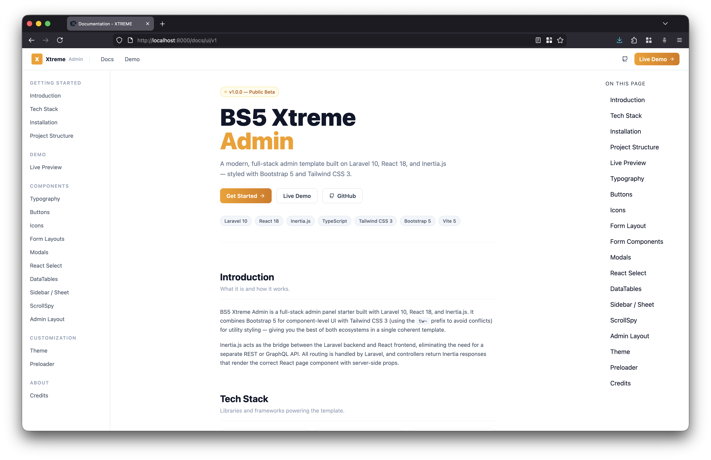
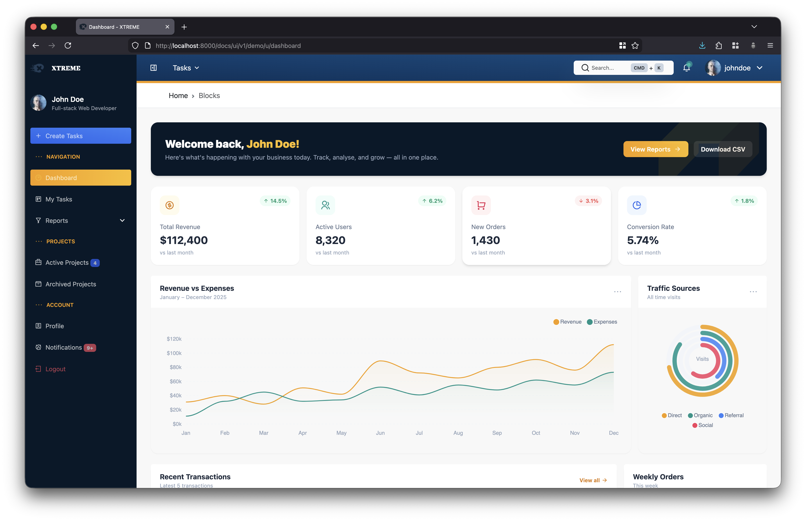
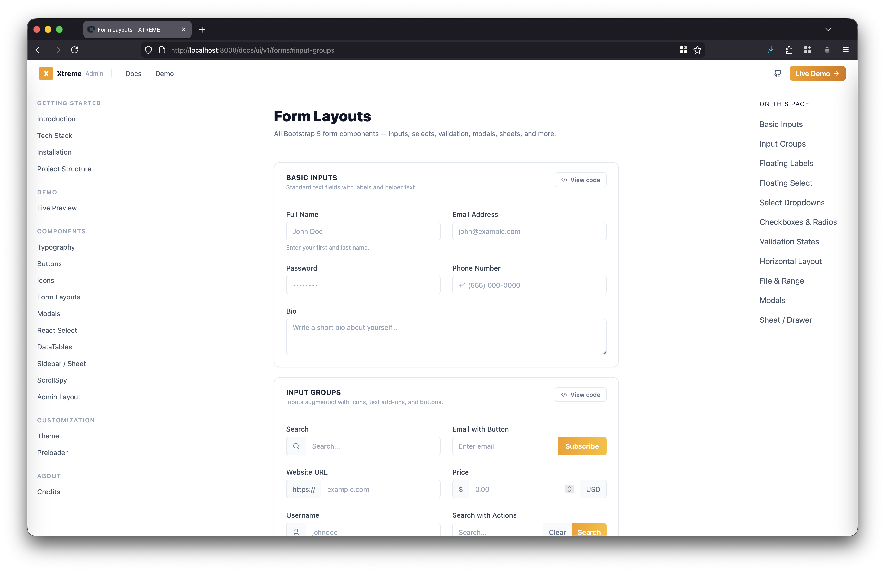
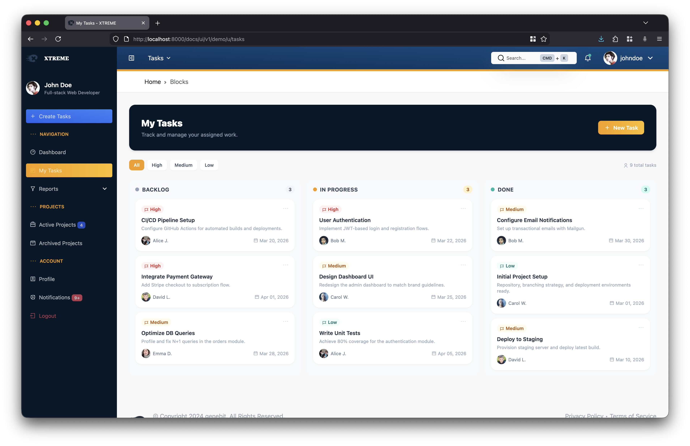

# BS5 Xtreme Admin `v1.1.0`

A clean **Laravel 10 + React 18 + Inertia.js** admin panel starter template. Combines Bootstrap 5 and Tailwind CSS (with a `tw-` prefix to avoid conflicts), ships with pre-built layouts, reusable components, and a live component reference.

---

## What's Included

| Item | Description |
|------|-------------|
| `AdminLayout` | Full admin shell — collapsible sidebar, top header, breadcrumbs, footer |
| `DocsLayout` | Documentation layout with fixed left nav and scroll-spy right sidebar |
| `Sheet` | Slide-over panel component (left or right side) |
| `ScrollSpy` | Scroll-aware section navigation |
| `PageHero` | Consistent page heading component |
| `Preloader` | Full-screen loading screen |
| Component reference | Live docs at `/docs/ui/v1/` covering typography, buttons, icons, forms, modals, and more |

---

## Screenshots

| | |
|---|---|
|  |  |
| Documentation | Dashboard |
|  |  |
| Form Layouts | Tasks |

---

## Tech Stack

| Technology   | Version | Role                              |
|--------------|---------|-----------------------------------|
| Laravel      | v10     | PHP MVC backend framework         |
| React        | v18     | Component-based UI library        |
| Inertia.js   | v1      | Server-driven SPA bridge          |
| TypeScript   | v5      | Statically typed JavaScript       |
| Tailwind CSS | v3      | Utility-first CSS (`tw-` prefix)  |
| Bootstrap    | v5      | Component CSS library             |
| Vite         | v5      | Frontend build tool               |
| RemixIcon    | v4      | 2,800+ open-source SVG icons      |
| ApexCharts   | v3      | Interactive data visualization    |

---

## Requirements

- PHP >= 8.1
- Composer
- Node.js >= 18
- npm

---

## Getting Started

### Option A — Download the release (recommended)

1. Go to the [Releases](https://github.com/genebit/xtreme-react/releases) page.
2. Under `release/v1.1.0`, click **Source code (zip)** to download.
3. Extract the archive and rename the folder to your project name.
4. Follow the **Install & Run** steps below.

### Option B — Clone the release branch

```bash
git clone -b release/v1.1.0 https://github.com/genebit/xtreme-react.git my-app
cd my-app
```

---

## Install & Run

### 1. Install dependencies

```bash
composer install
npm install
```

### 2. Configure environment

```bash
cp .env.example .env
php artisan key:generate
```

> No database is required for the template. Add your `DB_*` values to `.env` and run `php artisan migrate` when your app needs one.

### 3. Start development servers

```bash
# Terminal 1 — Laravel
php artisan serve

# Terminal 2 — Vite
npm run dev
```

Visit `http://localhost:8000`. The root `/` redirects to the component reference at `/docs/ui/v1/`.

---

## Project Structure

```
xtreme-react/
├── app/Http/Controllers/v1/Web/
│   ├── DocumentationController.php    # Docs landing page
│   └── FormsController.php            # Form component reference
│
├── resources/
│   ├── css/
│   │   ├── app.css                    # Global styles entry
│   │   ├── components.css             # Bootstrap overrides and focus ring
│   │   └── loader.css                 # Preloader animation
│   │
│   └── js/
│       ├── Components/
│       │   ├── PageHero.tsx           # Page heading component
│       │   ├── Preloader.tsx          # Full-screen loading screen
│       │   ├── ScrollSpy.tsx          # Scroll-aware section nav
│       │   └── Sheet.tsx              # Slide-over panel (left / right)
│       │
│       ├── Layouts/
│       │   ├── AdminLayout.tsx        # Admin shell (sidebar + header)
│       │   ├── DocsLayout.tsx         # Docs layout with scroll-spy sidebar
│       │   └── GuestLayout.tsx        # Minimal guest wrapper
│       │
│       └── Pages/
│           ├── Guest/
│           │   └── LandingPage.tsx    # Component reference home
│           └── UI/
│               └── Forms/
│                   └── FormsPage.tsx  # Form component reference
│
└── routes/web.php
```

---

## Routes

| Path              | Name      | Description              |
|-------------------|-----------|--------------------------|
| `/`               | —         | Redirects to docs        |
| `/docs/ui/v1/`    | `landing` | Component reference home |
| `/docs/ui/v1/forms` | `forms` | Form component reference |

---

## Adding Your First Page

1. Create a controller in `app/Http/Controllers/v1/Web/`:

```php
class MyPageController extends Controller
{
    public function index()
    {
        return Inertia::render('MyPage');
    }
}
```

2. Register a route in `routes/web.php`:

```php
Route::get('/my-page', [MyPageController::class, 'index'])->name('my-page');
```

3. Create the page at `resources/js/Pages/MyPage.tsx`:

```tsx
import AdminLayout from "@/Layouts/AdminLayout";
import PageHero from "@/Components/PageHero";

export default function MyPage() {
  return (
    <AdminLayout headTitle="My Page">
      <PageHero title="My Page" subtitle="Description." />
      <div className="tw-p-6">
        {/* content */}
      </div>
    </AdminLayout>
  );
}
```

---

## Building for Production

```bash
npm run build
```

---

## Author

**Johcel Gene T. Bitara** — SWE / Applications Programmer

---

## License

MIT
